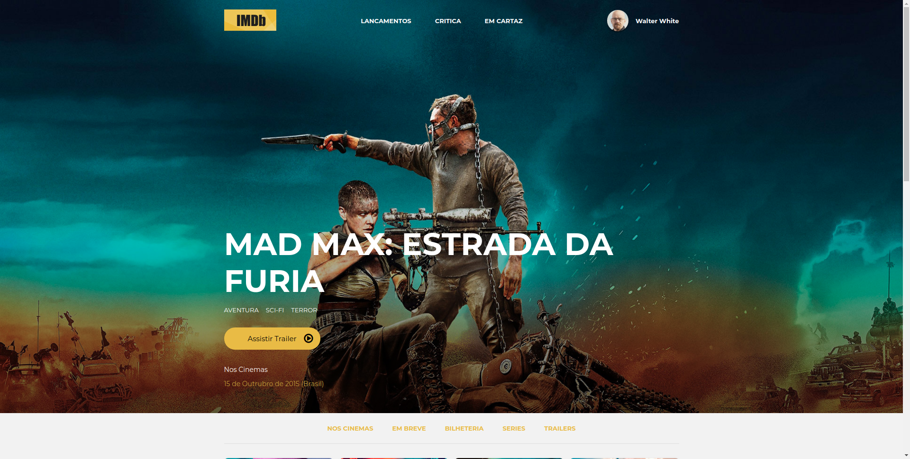
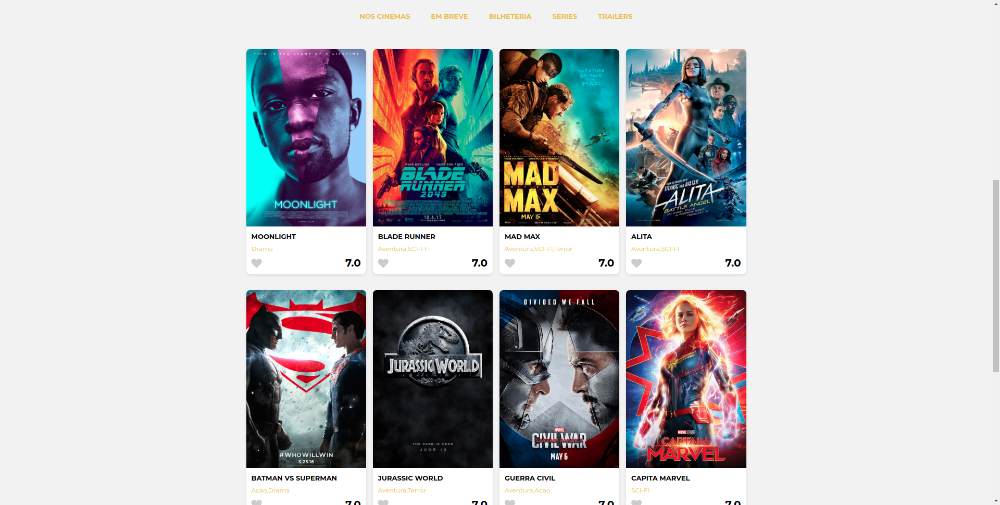
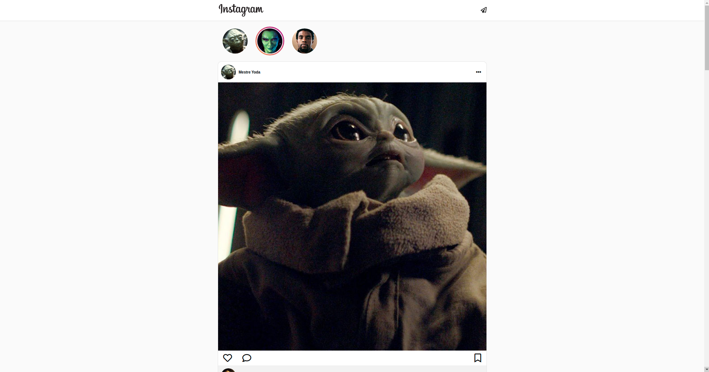
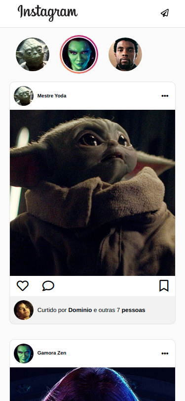

# Projects given as exemple to study

This repository store all the projects passed as an example by Codenation.

# [Classes](classes)
Here will be all the examples given to teach how the technologies works.

- [Modulo 1](classes/modulo1): This project is basic, only HTML5 and CSS3. It is a static blog.
- [Modulo 2](classes/modulo2): Just a HTML card to show how to use BEM methodology on CSS.

# [Challenges](challenges)
Here will be all the challenges given by Codenation.

### [IMDB](challenges/IMDB)

This is a movie review site (IMDB - Internet Movies Database) using only HTML and CSS.

  
  

### [Instagram](challenges/Instagram)

This is a similar copy of the Instagram layout using only HTML and CSS. It is resposive.

  
  

